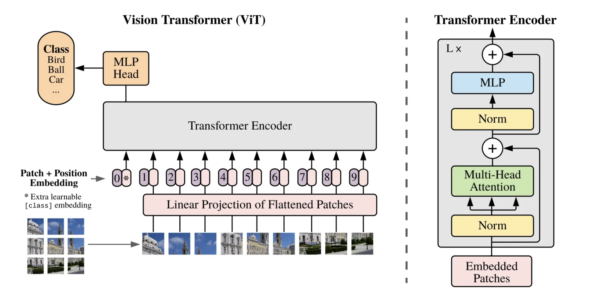
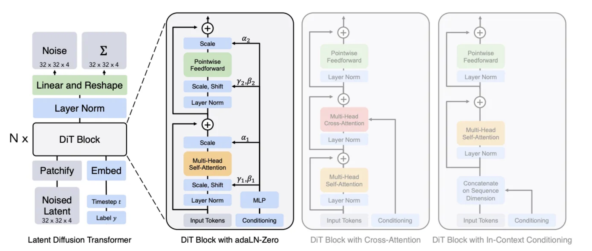

# Transformers

Transformer is a neural network architecture for AI. Transformer can be used for language model, diffusion model and classification model etc.

## Language Model

Transformers are first used for language model.
* [Vizuara lab: The Transformers](https://www.vizuaranewsletter.com/p/the-transformers?r=5b5pyd&utm_campaign=post&utm_medium=web)

### Decoder-Only Transformers

* [StatQuest video: Decoder-Only Transformers, ChatGPTs specific Transformer, Clearly Explained!!!](https://www.youtube.com/watch?v=bQ5BoolX9Ag)

## Vision Transformers

Transformers are later used for image models. For example, we can patch an image to sequences of tokens.

## Video Vision Transformer
* [GeeksforGeeks: Video Vision Transformer (ViViT)](https://www.geeksforgeeks.org/computer-vision/video-vision-transformer-vivit/)
* [Medium: Video Transformer(VIT): A Deep Learning Model for Video Processing](https://medium.com/@nadav6stern/video-transformer-vit-a-deep-learning-model-for-video-processing-442268c8c3b4)

## Diffusion Transformer

