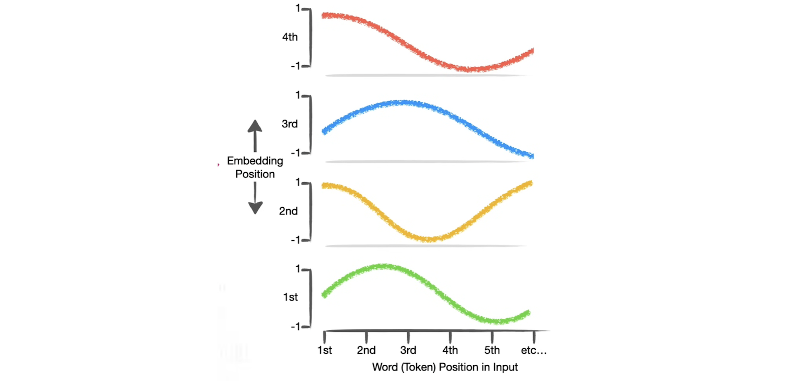

# How Transformers Work

Below we will have a step-by-step instruction how transformer works in a decoder-only language model, which is used for **ChatGPT**. 

We followed the StatQuest video: [Decoder-Only Transformers, ChatGPTs specific Transformer, Clearly Explained!!!](https://www.youtube.com/watch?v=bQ5BoolX9Ag) to explain how how a decoder-only transformer can take a simple input prompt, and generate a simple response.

The explanation also covers detailed computation step by step using more math way. We used all numbers shown in the above video. Meanwhile, the notebook under this directory has the correspodning transformer code.

### Example:

In ChatGPT:

* A: What is StatQuest?
* B: Awesome.

Now we have a simple vocabulary and the **tokens** are: "what", "is", "StatQuest", "awesome", "< EOS >".
Here EOS stands as "end of sentence" or "end of sequence". Therefore we can simply represent the tokens as vectors:

$$
w["what"] = \begin{bmatrix} 
1  \\
0  \\
0  \\
0  \\
0
\end{bmatrix}, \ \ 
w["is"] = \begin{bmatrix} 
0  \\
1  \\
0  \\
0  \\
0
\end{bmatrix}, \ \ 
w["StatQuest"] = \begin{bmatrix} 
0  \\
0  \\
1  \\
0  \\
0
\end{bmatrix}, \cdots
$$

In a decoder-only transformer, we need to process the following components:
1. Word Embedding
2. Positional Encoding

## 1. Word Embedding

Suppose we already have a simple D=2 word embedding (assume the embedding model was trained before) which can convert the input token to numbers:

$$
E = \begin{bmatrix} 
-2.38 & 0.61 & -2.38 & 2.21 & 2.92 \\
0.1 & 0.17 & 0.1 & -0.64 & -2.97 
\end{bmatrix}.
$$

and the activation function is just a linear function, e.g. $f(x)=x$. A word embedding is givn by $f(E \cdot w(". ."))$. 

Thus the word embeddings of the above tokens are

$$
e("what") =  \mathbf{E} w["what"] = \begin{bmatrix} 
-2.38 & 0.61 & -2.38 & 2.21 & 2.92 \\
0.1 & 0.17 & 0.1 & -0.64 & -2.97 
\end{bmatrix} \begin{bmatrix} 
1  \\
0  \\
0  \\
0  \\
0
\end{bmatrix} = \begin{bmatrix} 
-2.38  \\
0.1
\end{bmatrix}.
$$

$$
e("is") = E w["is"] = \begin{bmatrix} 
0.61  \\
0.17
\end{bmatrix},
$$

$$
e("StatQuest") = E w["StatQuest"] = \begin{bmatrix} 
-2.38  \\
0.1
\end{bmatrix}.
$$

## 2. Positional Encoding

The positional encoding functions are like

Since embedding dimension D = 2, we only need to look up first two plots, and first three token positions. Thus the inputs from the tokens are

$$
"what" = \begin{bmatrix} 
1  \\
0  \\
0  \\
0  \\
0  
\end{bmatrix}
\to 
\begin{bmatrix} 
-2.38  \\
0.1
\end{bmatrix} +  
\begin{bmatrix} 
0  \\
1
\end{bmatrix} = 
\begin{bmatrix} 
-2.38  \\
1.1
\end{bmatrix},
$$

$$
"is" = \begin{bmatrix} 
0  \\
1  \\
0  \\
0  \\
0  
\end{bmatrix}
\to 
\begin{bmatrix} 
0.61  \\
0.17
\end{bmatrix} +  
\begin{bmatrix} 
0.8  \\
0.54
\end{bmatrix} = 
\begin{bmatrix} 
1.41  \\
0.71
\end{bmatrix},
$$

$$
"statQuest" = \begin{bmatrix} 
0  \\
0  \\
1  \\
0  \\
0  
\end{bmatrix}
\to 
\begin{bmatrix} 
-2.38  \\
0.1
\end{bmatrix} +  
\begin{bmatrix} 
0.9  \\
-0.42
\end{bmatrix} = 
\begin{bmatrix} 
-1.47  \\
-0.32
\end{bmatrix},
$$

## 3. Q, K, V Matrices 

Assume we have Q/K/V matrices (from trained or randomly initialized) as 

$$
Q = \begin{bmatrix} 
-0.8 & -1.7 \\
0.4 & 2.8  
\end{bmatrix}, \ \ \ 
K = \begin{bmatrix} 
-1.5 & 0.7 \\
1.5 & -2.1  
\end{bmatrix}, \ \ \ 
V = \begin{bmatrix} 
1 & -0.5 \\
0.6 & 0.1  
\end{bmatrix}.
$$ 

Then for **Query** for "is", 

$$
Q<"is"> = \begin{bmatrix} 
-0.8 & -1.7 \\
0.4 & 2.8  
\end{bmatrix}
\begin{bmatrix} 
1.45 \\
0.71
\end{bmatrix}
\sim \begin{bmatrix} 
-2.4 \\
2.6
\end{bmatrix}.
$$

**Key** for "what" and "is" are

$$ 
K<"is"> = \begin{bmatrix} 
-1.5 & 0.7 \\
1.5 & -2.1  
\end{bmatrix}
\begin{bmatrix} 
1.45 \\
0.71
\end{bmatrix}
\sim \begin{bmatrix} 
-1.7 \\
0.7
\end{bmatrix}, \ \ \ 
V = \begin{bmatrix} 
1 & -0.5 \\
0.6 & 0.1  
\end{bmatrix}.
$$ 