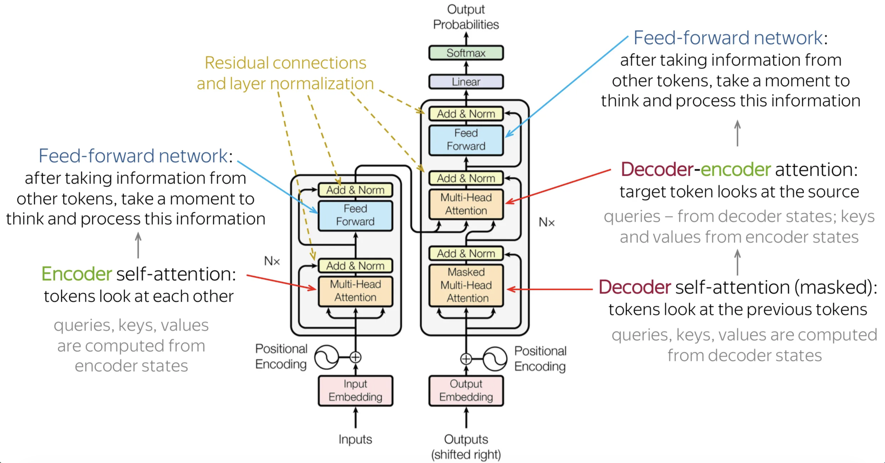

# Encoder + Decoder Translator

The translator code here follows the medium post: [Building a Sequence-to-Sequence Transformer Model for Language Translation](https://medium.com/@samson.sabu/building-a-sequence-to-sequence-transformer-model-for-language-translation-ac4a37533cfa).

## Understanding the Transformer Architecture

The Transformer architecture consists of an encoder-decoder structure:

* **Encoder**: The encoder processes the input sequence and converts it into a set of continuous representations, called memory, that the decoder will use to generate the output sequence.
* **Decoder**: The decoder takes the encoder’s memory and the target sequence (shifted by one token) to generate the predicted sequence token by token.

The transformer uses self-attention mechanisms to capture relationships between words in a sentence regardless of their distance, making it highly efficient for **sequence-based tasks like translation**.

**For translation task, in transformers, decoder provides queries, and encoded look up keys and values.**

In the training process, we:
* Use **Cross-Entropy Loss** to compute the loss.
* Use **Adam** as the optimizer.
* Use metrics like **BLEU score** to evaluate the model.

## The Roles in Cross-Attention

To understand why "the decoder provides the queries" and "the encoder provides the keys and values", it helps to use the analogy of a **library retrieval system**:

* The **Queries ($Q$)** come from the **Decoder**: Think of the Query as the **search term**.
    * The decoder looks at the words it has translated so far and asks a question: "Based on what I've written, what information do I need from the original sentence to predict the very next word?"
* The **Keys ($K$)** come from the **Encoder**: Think of the Keys as the **tags or labels on the books in the library**.
    * The encoder has processed the entire original source sentence. The keys represent the grammar, position, and role of every word in that original sentence (e.g., "I am a verb," or "I am the subject of the sentence").
* The **Values ($V$)** come from the **Encoder**: Think of the Values as the **actual contents of the book**.
    * Once the decoder's Query matches strongly with an encoder's Key, the Transformer pulls the corresponding Value (the rich, mathematical representation of that word's meaning) and uses it to generate the next translated word.

### A Concrete Example: French $\to$ English

Imagine translating the French sentence "Le chat noir" into English ("The black cat"):
* "Le chat noir" is the input. (and $\langle \textrm{EOS} \rangle$ is the end token)
* The Encoder processes "Le chat noir" and generates Keys and Values for all three words.
* The **Decoder** starts translating. 
* Let's say it has already generated the word "The". Now the decoder has produced $\langle \textrm{BOS} \rangle \ \textrm{The}$.

#### 1. Predicting the second word: "black"

*  Then Decoder needs to determine, after "The", what the next token is. Now **Query** =  "The".
*  This Query is compared against **all** the **Keys** from the French sentence. It calculates the dot product between the Query for "The" and the Keys for "Le", "chat", and "noir". Because the model learned during training that English puts adjectives first, the Query strongly aligns with the Key for "noir" (black). 
*  The attention weights heavily favor "noir". The Value vector for "noir" is pulled in, passed through the feed-forward network.
*  The decoder outputs "black".

#### 2. Predicting the third word: "cat"

*  The decoder's sequence is now $\langle \textrm{BOS} \rangle \ \textrm{The black}$. Now Query = "black".
*  The Cross-Attention: It asks the encoder: "I have 'The black...'. What is the noun?"
*  The Query compares against the Encoder's Keys again. Since it has already successfully extracted the meaning of "Le" and "noir", the highest mathematical match is now the Key for "chat".
*  The decoder outputs: "cat".

#### 3. Knowing when to stop: $\langle \textrm{EOS} \rangle$

*  The decoder sequence is $\langle \textrm{EOS} \rangle \ \textrm{The black cat}$. Now Query = "cat"
*  The Cross-Attention: It asks the encoder: "I've built 'The black cat'. What's next?"
*  The Match: The Query checks the Encoder's Keys. All the semantic meaning from the French words has been "used up" and accounted for. The Query now strongly aligns with the Key for the French $\langle \textrm{EOS} \rangle$ (End of Sequence) token that was attached to the input.
*  The decoder outputs its own $\langle \textrm{EOS} \rangle$ token, which tells the system the translation is complete.

(Note: In English, adjectives come first, so the model would actually match with "noir" (black) first, but the Q-K-V mechanism remains exactly the same!)

### One Quick Caveat: Self-Attention

Just keep in mind that Transformers also use Self-Attention before they do Cross-Attention
* Inside the Encoder by itself, the Encoder provides its own Queries, Keys, and Values to understand the context of the source sentence.
* Inside the Decoder by itself, the Decoder provides its own Queries, Keys, and Values to ensure the grammar of the language it is generating makes sense.

