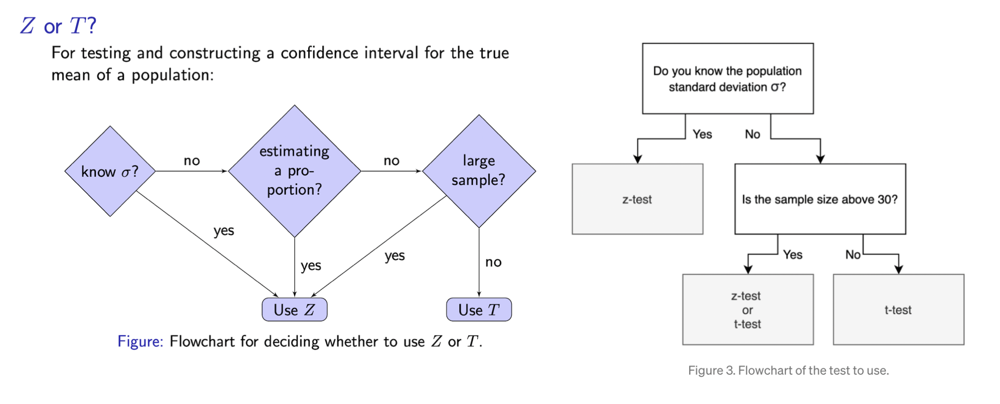
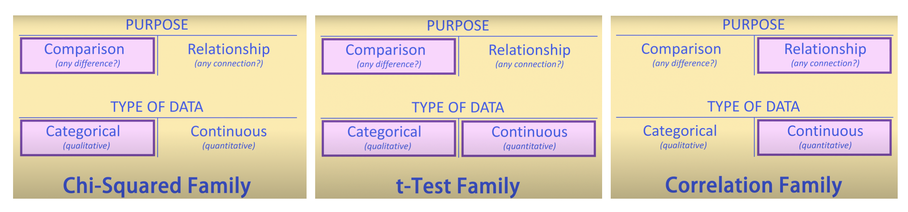
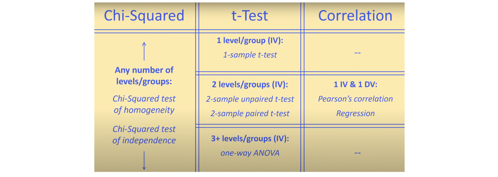

# Hypothesis Test

## Hypothesis

* Null, $H_0$: .... = $\mu$
* Alternative, $H_a$: .... >, <, $\ne \mu$.

$${\color{red} NOTE: \mu \ is \ awlays \ population \ parameter, \ never \ be \ sample \  statistic}$$.

[[Statistics How to]][Hypothesis Testing]

Use the following steps to set up hypothesis testing. Assume we compare a single mean:

* **Step 1**: State the Null hypothesis $H_0$. 
* **Step 2**: State the Alternate Hypothesis $H_a$.
* **Step 3**: Draw a picture to help you visualize the problem.
* **Step 4**: State the alpha level. If you aren’t given an alpha level, use 5% (0.05). 
* **Step 5**: Find the test statistic. For nearly normal point estimate, z-statistic is

$$Z = \frac{\textrm{point estimate - null value}}{\textrm{standard error}}$$

* **Step 6**: Determine if rejection the null hypothesis.

Check Condition:
1. **Independent**: Sample observations must be independent (random sample/assignment & if sampling without replacement, $n < 10%$ of population).
2. Sample size/skew: n ≥ 30, larger if the population distribution is very skewed.

### P-value

From Coursera course **Inferential Statistcs**, p-value is the probability

$$\textrm{p-value} = Pr \big(\textrm{observed or more extreme outcome}|H_0 \textrm{ is true} \big).$$

If p-value is very low, we have strong evidence against the null hypothesis. Therefore we can reject $H_0$. Otherwise we cannot reject $H_0$.

For example, if a hypothesis: 
* $H_0$: $\mu=3$,
* Our sample has $\bar{X}=3.2$ and $s=1.74$,
* $n=50$, so $\textrm{SE} = s/\sqrt{50} = 0.246$, 

We obtain the test statistic Z = (3.2-3)/0.246 = 0.81. For one trailed, p-value = $P(\bar{X} > 3.2 |H_0: \ \mu=3) = 0.209$.

It is interpreted as:
* If in fact population has mean = 3 on average, there is a 21% chance that a random sample of 50 would yield a sample mean of 3.2 or higher.
* This is a pretty high probability, so a sample mean of 3.2 or more is likely to happen simply by chance. So we don't have enough evidence to reject the null hypothesis, even if $H_0$ is true.

### Agreement Between Confidence Level (CL) and Hypothesis Testing

[[Coursera: Inferential Statistics: Significance vs Confidence Level]][Significance vs Confidence Level]

* A two sided hypothesis with threshold of $\alpha$ is equivalent to a confidence
interval with CL = $1 − \alpha$.
* A one sided hypothesis with threshold of α is equivalent to a confidence
interval with CL = $1 − 2\alpha$.
* If $H_0$ is rejected, a confidence interval that agrees with the result of the
hypothesis test should not include the null value.
* If $H_0$ is failed to be rejected, a confidence interval that agrees with the
result of the hypothesis test should include the null value.

# Z-Test or T-Test?

There are many hypothesis testings. Most common ones are z-test and t-test, depending on sample variable types (numeric or categorical?), sample size and other conditions (population standard deviation is known or not).

There is a simple workflow to determine if using Z-test or T-test: Credits from [slide # 18 from S. Massa](http://www.stats.ox.ac.uk/~massa/Lecture%2010.pdf) and [From the Central Limit Theorem to the Z- and t-distributions](https://towardsdatascience.com/introduction-tfrom-the-central-limit-theorem-to-the-z-and-t-distributions-66513defb175).

Even though population is not skewed but if sample size is large (`n > 30`), we can still use t-test due to central limit theorem [[Javier Fernandez]][From the Central Limit Theorem to the Z- and t-distributions], [[Jonathan Bartlett]][The t-test and robustness to non-normality], [[The Role of Probability]][Central Limit Theorem]. However, if small sample size, we can use boostrapping to generate boostrapping distribution and evaluate the confidence interval [Coursera-Bootstrapping](https://www.coursera.org/learn/inferential-statistics-intro/lecture/u3k1n/bootstrapping).

# Chi-Square or T test?

Select various inference, depending on data type, categorical or numeric and purpose. See the youtube explanation [Choosing a Statistical Test for Your IB Biology IA](https://www.youtube.com/watch?v=ulk_JWckJ78)

If more than 2 groups to compare, we use ANOVA.

## Nonparametric Test

Nonparametric tests do not assume a specific distribution for the population, e.g. normality. These tests can be especially useful when you have a small sample that is skewed or a sample that contains several outliers [[Minitab]][What to do with nonnormal data].

| Test that assumes normality | Nonparametric test equivalents | 
| --- | --- | 
| 1-Sample Z, 1-sample-t | 1-Sample Sign, 1-Sample Wilcoxon | 
| 2-Sample t | Mann-Whitney | 
| ANOVA | Kruskal-Wallis, Mood's median, Friedman | 

Nonparametric tests are not completely free of assumptions about your data: for example, they still require the data to be an independent random sample.

#### Reference

* [From the Central Limit Theorem to the Z- and t-distributions]: https://towardsdatascience.com/introduction-tfrom-the-central-limit-theorem-to-the-z-and-t-distributions-66513defb175
[[Javier Fernandez] From the Central Limit Theorem to the Z- and t-distributions](https://towardsdatascience.com/introduction-tfrom-the-central-limit-theorem-to-the-z-and-t-distributions-66513defb175)

* [The t-test and robustness to non-normality]: https://thestatsgeek.com/2013/09/28/the-t-test-and-robustness-to-non-normality/
[[Jonathan Bartlett] The t-test and robustness to non-normality](https://thestatsgeek.com/2013/09/28/the-t-test-and-robustness-to-non-normality/)

* [What to do with nonnormal data]: https://support.minitab.com/en-us/minitab/19/help-and-how-to/statistics/basic-statistics/supporting-topics/normality/what-to-do-with-nonnormal-data/
[[Minitab] What to do with nonnormal data](https://support.minitab.com/en-us/minitab/19/help-and-how-to/statistics/basic-statistics/supporting-topics/normality/what-to-do-with-nonnormal-data/)

* [Hypothesis Testing]: https://www.statisticshowto.com/probability-and-statistics/hypothesis-testing/
[[Statistics How to] Hypothesis Testing](https://www.statisticshowto.com/probability-and-statistics/hypothesis-testing/)

* [Central Limit Theorem]: https://sphweb.bumc.bu.edu/otlt/mph-modules/bs/bs704_probability/BS704_Probability12.html
[[The Role of Probability] Central Limit Theorem](https://sphweb.bumc.bu.edu/otlt/mph-modules/bs/bs704_probability/BS704_Probability12.html)

* [Significance vs Confidence Level]: https://www.coursera.org/learn/inferential-statistics-intro/lecture/ruckh/significance-vs-confidence-level
[[Coursera: Inferential Statistics: Significance vs Confidence Level] Significance vs Confidence Level](https://www.coursera.org/learn/inferential-statistics-intro/lecture/ruckh/significance-vs-confidence-level)