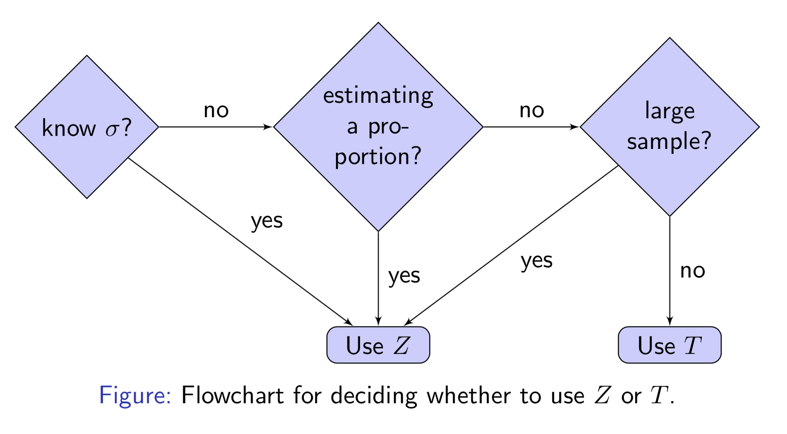
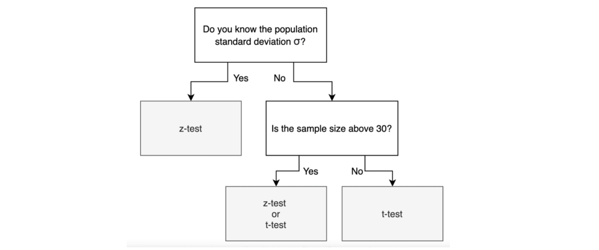
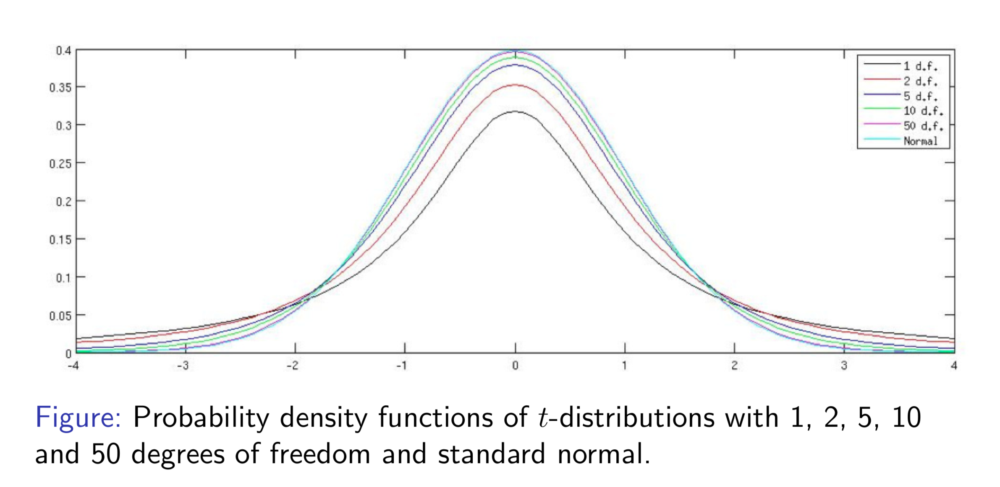

# T-Test 

For comparing means, t-test is used when: 
* **sample size is too small** 
* or **population standard deviation is unknown**. 

Note we have the assumption the sample is an approximate normal distribution.

## When to use T-test rather than Z-test

Suppose we have sample $X = \lbrace X_1, X_2, \cdots, X_n \rbrace$, the sample mean is $\bar{X}$, and the population mean $\mu$ and the population standard deviation $\sigma$. Our null and alternative hypotheses are

$$\textrm{H}_0: \bar{X} = \mu, \ \ \textrm{H}_a: \bar{X} \ne \mu.$$

Then the z-statistic computed from the sample is

$$z = \frac{\bar{X}-\mu}{\sigma/\sqrt{n}}.$$

However, if we **do not know the population variance σ**, we simply replaced it with the sample standard deviation $s$,

$$s = \sqrt{\frac{1}{n-1}\sum^n_{i=1}(X_i-\bar{X})^2},$$

which is an estimate of $\sigma$ from the sample.

Now we have similar format to z-statistic, called t-statistic, defined as

$$t = \frac{\bar{X}-\mu}{s/\sqrt{n}}.$$

The distribution of T will be **more dispersed** than that of Z. This implies that you underestimate probabilities of extreme observations, such that what you compute have too narrow confidence intervals.

The workflow to determine using z-test or t-test is as follows [[Massa]][S. Massa, t-Test]

from [[Javier Fernandez]][From the Central Limit Theorem to the Z- and t-distributions]

## Student’s T-Distribution

William Gossett computed the distribution of the t-statistic while working for the Guiness brewery, published it under the pseudonym Student, so called Student's t-distribution. He was concerned with **small sample sizes**.

The t-distribution has a single parameter called **the number of degrees of freedom**; this is equal to the sample size minus 1:

$$df = n-1.$$

For large samples, typically more than 50, the sample standard deviation is very accurate, and the t-distribution is close to a normal distribution. See below [[Massa]][S. Massa, t-Test].

For two-sided z-test and 95% confidence, the critical value of statisitic is 1.96. The t-test critical values for degree of freedoms (df) = 10 and 50 are 2.23 and 2.01, respectively. Thus we can see the t-distribution with df = 50 is quite close to a z-test.

In the other side, we can compare the probabilities given a test statistics. For example,
* $P(|t_{df=10}| > 2) = 0.0734$
* $P(|t_{df=50}| > 2) = 0.0509$
* $P(|Z| > 2) = 0.0455$

We can see the t-distribution with higher degrees of freedom, the probabilities are closer to Z-distribution. For test statistic = 2, we reject the null hypothesis in Z-test but fail to reject it in T-test. 

The confidence interval estimate for t-distribution can be found [here](https://github.com/HsiangHung/Machine_Learning_Note/tree/master/Statistics/confidence_internvals#ci-for-t-distribution).

## Paired T-test (Two Dependent Sample)

The two-sample t-test is used to determine where the two samples are dependent and come in pair, like patents' reaction before and after treatment. The sample sizes are the same. For each sample observation, we need to compute the difference, and 

$$\textrm{H}_0: \bar{X}_d =0, \ \ \textrm{H}_a: \bar{X}_d \ne0.$$

The test statistic is

$$t_{n-1} = \frac{\bar{X}_d - 0 }{s_d/\sqrt{n_d}},$$

which describes the t distribution on $n-1$ degrees of freedom. $n_d$ is the number of pairs.

Also see [Inferential Statistics: Inference for comparing two paired means](https://www.coursera.org/learn/inferential-statistics-intro/lecture/k5zhM/inference-for-comparing-two-paired-means)

## Two Independent Sample T-Test

The two-sample t-test is used to determine if two population means are equal [[NIST Two-Sample t-Test]][NIST, 1.3.5.3. Two-Sample t-Test for Equal Means], [[Plonsky]][M. Plonsky, Hypothesis Testing: Continuous Variables (2 Sample)]

$$\textrm{H}_0: \bar{X}_1 = \bar{X}_2, \ \ \textrm{H}_a: \bar{X}_1 \ne \bar{X}_2.$$

or 

$$\textrm{H}_0:  \ \bar{X}_1 - \bar{X}_2 = 0, \  \ \textrm{H}_a: \bar{X}_1 - \bar{X}_2 \ne 0.$$

If population standard deviations are known, then we have z-statistic

$$z = \frac{\bar{X}_1-\bar{X}_2}{\sqrt{\frac{\sigma^2_1}{n_1}+\frac{\sigma^2_2}{n_2}}}.$$

If the population standard deviations are unknown, the t-test test statistic is

$$t =\frac{\bar{X}_1-\bar{X}_2}{\sqrt{\frac{s^2_1}{n_1}+\frac{s^2_2}{n_2}}}.$$

where $s_1$ and $s_2$ are the sample variances. If equal variances are assumed, the test statistic becomes

$$t = \frac{\bar{X}_1-\bar{X}_2}{s_p\sqrt{\frac{1}{n_1}+\frac{1}{n_2}}},$$

where $s_p$ is the pool sample variance 

$$s_p = \sqrt{\frac{(n_1-1)s_1^2+(n_2-1)s_2^2}{n_1+n_2-2}}.$$

Also see [Inferential Statistics: Inference for comparing two independent means](https://www.coursera.org/learn/inferential-statistics-intro/lecture/wkwlZ/inference-for-comparing-two-independent-means)

## Correction Factor

So far we have used the following formula for the standard error:

$$\textrm{SE} = \textrm{var}(X) = \frac{\sigma}{\sqrt{n}}.$$

This is based on the premise that we are sampling from an infinite population [[Massa]][S. Massa, t-Test]. Usually sampling is performed from a finite population and without replacement. In this case, if a **significant proportion of the population > 5% is sampled**, we need to use the correction factor, such that standard error becomes

$$\textrm{SE} = \frac{\sigma}{\sqrt{n}} \sqrt{\frac{N-n}{N-1}}.$$

## The t-test and robustness to non-normality

Even though population is not skewed but if sample size is large (`n > 30`), we can still use t-test due to central limit theorem [[Javier Fernandez]][From the Central Limit Theorem to the Z- and t-distributions], [[Jonathan Bartlett]][The t-test and robustness to non-normality], [[The Role of Probability]][Central Limit Theorem]. However, if small sample size, we can use boostrapping to generate boostrapping distribution and evaluate the confidence interval [Coursera-Bootstrapping](https://www.coursera.org/learn/inferential-statistics-intro/lecture/u3k1n/bootstrapping).

## Reference

* [S. Massa, t-Test]: http://www.stats.ox.ac.uk/~massa/Lecture%2010.pdf
[[Massa] S. Massa, t-Test](http://www.stats.ox.ac.uk/~massa/Lecture%2010.pdf)

* [NIST, 1.3.5.3. Two-Sample t-Test for Equal Means]: https://www.itl.nist.gov/div898/handbook/eda/section3/eda353.htm
[[NIST Two-Sample t-Test] NIST, 1.3.5.3. Two-Sample t-Test for Equal Means](https://www.itl.nist.gov/div898/handbook/eda/section3/eda353.htm)

* [From the Central Limit Theorem to the Z- and t-distributions]: https://towardsdatascience.com/introduction-tfrom-the-central-limit-theorem-to-the-z-and-t-distributions-66513defb175
[[Javier Fernandez] From the Central Limit Theorem to the Z- and t-distributions](https://towardsdatascience.com/introduction-tfrom-the-central-limit-theorem-to-the-z-and-t-distributions-66513defb175)

* [The t-test and robustness to non-normality]: https://thestatsgeek.com/2013/09/28/the-t-test-and-robustness-to-non-normality/
[[Jonathan Bartlett] The t-test and robustness to non-normality](https://thestatsgeek.com/2013/09/28/the-t-test-and-robustness-to-non-normality/)

* [Penn State, Applied Statistic: Comparing Two Population Proportions with Independent Samples]: https://newonlinecourses.science.psu.edu/stat500/node/55/
[[PSU, 1] Penn State, Applied Statistic: Comparing Two Population Proportions with Independent Samples](https://newonlinecourses.science.psu.edu/stat500/node/55/)

* [Penn State, Probability Theory and Mathematical Statistics: Comparing Two Proportions]: https://newonlinecourses.science.psu.edu/stat414/node/268/
[[PSU, 2] Penn State, Probability Theory and Mathematical Statistics: Comparing Two Proportions](https://newonlinecourses.science.psu.edu/stat414/node/268/)

* [M. Plonsky, Hypothesis Testing: Continuous Variables (2 Sample)]: https://www4.uwsp.edu/psych/stat/11/hyptest2s.htm
[[Plonsky] M. Plonsky, Hypothesis Testing: Continuous Variables (2 Sample)](https://www4.uwsp.edu/psych/stat/11/hyptest2s.htm)

* [Stattrek, Hypothesis Test for a Proportion]: https://stattrek.com/hypothesis-test/proportion.aspx
[[Stattrek: Hypothesis Test for a Proportion] Stattrek, Hypothesis Test for a Proportion](https://stattrek.com/hypothesis-test/proportion.aspx)

* [Stattrek, Hypothesis Test: Difference Between Proportions]: https://stattrek.com/hypothesis-test/difference-in-proportions.aspx
[[Stattrek: Difference Between Proportions] Stattrek, Hypothesis Test: Difference Between Proportions](https://stattrek.com/hypothesis-test/difference-in-proportions.aspx)

* [Central Limit Theorem]: https://sphweb.bumc.bu.edu/otlt/mph-modules/bs/bs704_probability/BS704_Probability12.html
[[The Role of Probability] Central Limit Theorem](https://sphweb.bumc.bu.edu/otlt/mph-modules/bs/bs704_probability/BS704_Probability12.html)

